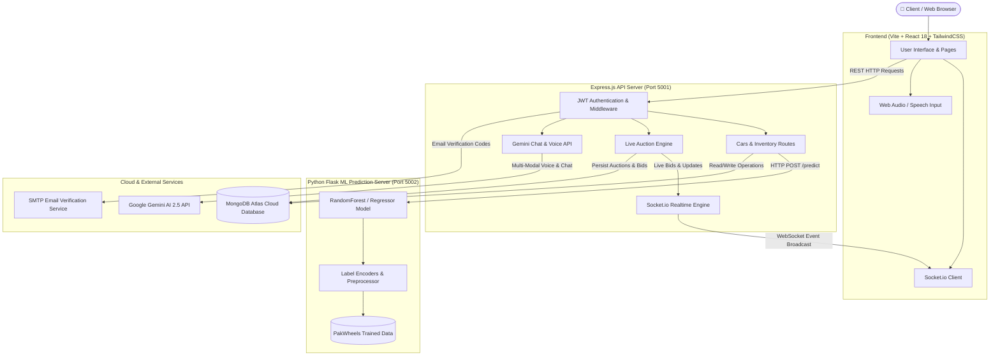
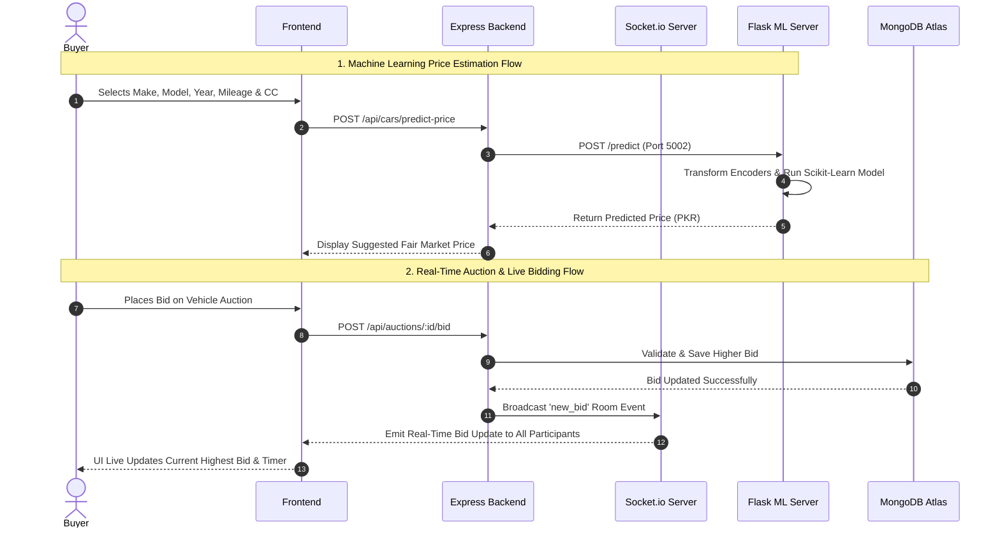

# 🚗 AutoMarket AI — Intelligent Automotive Marketplace & Real-Time Auction Platform

[](https://reactjs.org/)
[](https://vitejs.dev/)
[](https://nodejs.org/)
[](https://expressjs.com/)
[](https://www.mongodb.com/)
[](https://socket.io/)
[](https://www.python.org/)
[](https://scikit-learn.org/)
[](https://ai.google.dev/)

**AutoMarket AI** is an advanced full-stack automotive marketplace platform powered by Artificial Intelligence and Real-Time WebSockets. It enables buyers and sellers in Pakistan to discover, evaluate, price-predict, bid on, and trade vehicles with natural Urdu & English AI voice assistance.

---

## 📐 System Architecture & Flow Diagram



---

## 🔄 User Journey & Real-Time Bidding Flow



---

## ✨ Key Features

- 🤖 **Gemini Multi-Modal AI Chatbot**: Interactive conversational assistant supporting both **Urdu** and **English** for intelligent car recommendation and market queries.
- 🔮 **PakWheels ML Price Estimator**: Trained Machine Learning regression models (`pakwheels_price_model.pkl`) to accurately estimate fair market car prices in Pakistan.
- 🎤 **AI Voice-to-Listing Auto-Fill**: Voice-guided listing creation that transcribes speech and automatically extracts car metadata (Make, Model, Year, Fuel, Transmission, Price).
- ⚡ **Real-Time Auctions & Live Bidding**: Dynamic auction system powered by **Socket.io** web-sockets with automated countdown timers and instant bid synchronization.
- 💬 **Buyer-Seller Instant Chat**: Private messaging system for direct negotiations between buyers and vehicle owners.
- 📧 **Gmail Verification**: OTP code verification for secure account registration and password resets using Nodemailer SMTP.
- 🛡️ **Role-Based Admin Dashboard**: Comprehensive admin panel for inspecting, approving, rejecting, or removing car listings and managing registered users.

---

## 🗄️ Technology Stack

| Layer | Technologies Used |
| :--- | :--- |
| **Frontend** | React 18, Vite, TypeScript, TailwindCSS, Radix UI, Lucide Icons, Axios, Socket.io-Client |
| **Backend API** | Node.js, Express.js, Mongoose ODM, JWT Auth, Socket.io, Multer, Nodemailer |
| **AI & Machine Learning** | Python 3, Flask, Joblib, Scikit-Learn, Pandas, NumPy, Google Gemini 2.5 Flash API |
| **Database** | MongoDB Atlas (Cloud NoSQL Database) |
| **Deployment** | Render.com (Web Services + Static Site) |

---

## 📁 Exact Project Structure

```
automarket-ai/
├── src/                               # Frontend (Vite + React 18 + TypeScript)
│   ├── assets/                        # Branding assets, icons & logos
│   ├── components/                    # Reusable React UI Components
│   │   ├── ChatBot/                   # AI Voice & Text Chatbot (ChatBot.tsx)
│   │   ├── ui/                        # Radix UI primitives & Shadcn components
│   │   ├── CategoryCard.tsx           # Category card renderer
│   │   ├── FilterSidebar.tsx          # Advanced inventory filtering sidebar
│   │   ├── Header.tsx                 # Navigation header & notifications
│   │   ├── SearchBar.tsx              # Vehicle search bar
│   │   └── VehicleCard.tsx            # Vehicle listing card & favorites toggle
│   ├── config/                        # Centralized API & Socket config
│   │   └── api.ts                     # API_BASE_URL & SOCKET_URL exporter
│   ├── hooks/                         # Custom React hooks (use-toast.ts)
│   ├── lib/                           # Utility helpers (utils.ts)
│   ├── pages/                         # Application Page Views
│   │   ├── AdminDashboard.tsx         # Admin management panel
│   │   ├── Auctions.tsx               # Real-time auction listings view
│   │   ├── BuyNow.tsx                 # Direct buy vehicle catalog
│   │   ├── CreateListing.tsx          # Listing wizard with Voice Auto-Fill & ML Predictor
│   │   ├── ForgotPassword.tsx         # Gmail OTP verification password reset
│   │   ├── Inbox.tsx                  # Real-time Socket.io buyer-seller messaging
│   │   ├── Index.tsx                  # Landing homepage
│   │   ├── Inventory.tsx              # User vehicle inventory management
│   │   ├── Login.tsx                  # JWT & Google OAuth authentication
│   │   ├── Profile.tsx                # User profile & avatar manager
│   │   ├── Register.tsx               # Registration & email verification
│   │   └── VehicleDetails.tsx         # Vehicle detail, live bidding & inquiry view
│   ├── App.tsx                        # Main App router & layout container
│   ├── index.css                      # Global Tailwind CSS styles
│   └── main.tsx                       # React DOM entry point
│
├── server/                            # Backend API & ML Services (Node.js + Python)
│   ├── middleware/                    # Auth & Admin Access Middlewares
│   │   ├── adminAuth.js               # Admin role verification middleware
│   │   └── auth.js                    # JWT token validation middleware
│   ├── ml_models/                     # Trained Machine Learning Pickles (.pkl)
│   │   ├── pakwheels_price_model.pkl  # PakWheels trained price predictor model (~45MB)
│   │   ├── label_encoders.pkl         # Feature categorical label encoders
│   │   └── model_columns.pkl          # Model feature column definition
│   ├── models/                        # Mongoose Database Schemas
│   │   ├── Auction.js                 # Live auction schema
│   │   ├── Car.js                     # Vehicle listing schema
│   │   ├── Conversation.js            # Chat room schema
│   │   ├── Message.js                 # Direct chat message schema
│   │   ├── Notification.js            # User notification schema
│   │   ├── User.js                    # User account schema
│   │   └── VerificationCode.js        # Gmail OTP verification schema
│   ├── routes/                        # Express API Endpoints
│   │   ├── auctions.js                # Bidding & auction management
│   │   ├── auth.js                    # Auth, Profile & Google OAuth routes
│   │   ├── cars.js                    # Vehicle CRUD & ML price prediction call
│   │   ├── chat.js                    # Gemini AI Chatbot & Voice routes
│   │   ├── messages.js                # Real-time message history
│   │   └── notifications.js           # Notification triggers
│   ├── services/                      # Business Logic & External APIs
│   │   ├── aiService.js               # Groq AI fallback integration
│   │   ├── auctionScheduler.js        # Automatic auction expiry background timer
│   │   ├── emailService.js            # Nodemailer SMTP Gmail verification sender
│   │   ├── geminiChatService.js       # Google Gemini 2.5 Flash chatbot integration
│   │   ├── geminiVoiceService.js      # Gemini voice extraction service
│   │   ├── predict_server.py          # Python Flask ML Price Prediction Server (Port 5002)
│   │   └── whisperService.js          # Speech-to-text service
│   ├── uploads/                       # Car photo uploads directory
│   ├── .env.example                   # Environment variable template
│   ├── index.js                       # Express Server & Socket.io WebSockets Entry Point
│   ├── package.json                   # Backend Node dependencies
│   └── requirements.txt               # Python ML server dependencies (Flask, Joblib, Scikit-Learn)
│
├── index.html                         # Vite HTML template
├── package.json                       # Root Frontend npm dependencies & scripts
├── tailwind.config.ts                 # Tailwind CSS design system config
├── tsconfig.json                      # TypeScript configuration
└── vite.config.ts                     # Vite bundler configuration
```

---

## 🚀 Local Installation & Setup Guide

### 1. Prerequisites
Ensure you have the following installed on your system:
- **Node.js** (v18.x or higher)
- **Python** (v3.9 or higher)
- **Git**

---

### 2. Clone the Repository
```bash
git clone https://github.com/hamaad-codes/Automarket-AI-FYP.git
cd Automarket-AI-FYP
```

---

### 3. Backend Setup
Navigate into the `server` directory and install dependencies:
```bash
cd server
npm install
pip install -r requirements.txt
```

Create a `.env` file in the `server/` directory:
```env
PORT=5001
MONGO_URI=mongodb+srv://<username>:<password>@cluster.mongodb.net/automarket-ai?retryWrites=true&w=majority
JWT_SECRET=your_super_secret_jwt_key
GEMINI_API_KEY=your_google_gemini_api_key
GROQ_API_KEY=your_groq_api_key
SMTP_HOST=smtp.gmail.com
SMTP_PORT=587
SMTP_USER=your_email@gmail.com
SMTP_PASS=your_gmail_app_password
```

---

### 4. Frontend Setup
Navigate back to the root project directory and install frontend packages:
```bash
cd ..
npm install
```

Create a `.env` file in the root directory (optional for custom port):
```env
VITE_API_URL=http://localhost:5001
```

---

### 5. Running the Application Locally

#### Step A: Start the Python ML Flask Server
In a terminal, run:
```bash
cd server
python services/predict_server.py
```
*(Runs on `http://localhost:5002`)*

#### Step B: Start the Node.js Express Server
In a second terminal, run:
```bash
cd server
npm run dev
```
*(Runs on `http://localhost:5001`)*

#### Step C: Start the React Frontend Application
In a third terminal, run:
```bash
npm run dev
```
*(Open `http://localhost:8080` in your browser)*

---

## ☁️ Deployment Guide (Render.com)

This project is optimized for deployment on **Render**:

### Service 1: Express & ML Backend (Render Web Service)
- **Environment:** Node
- **Root Directory:** `server`
- **Build Command:** `npm install && pip install -r requirements.txt`
- **Start Command:** `python3 services/predict_server.py & node index.js`
- **Environment Variables:** Add `MONGO_URI`, `JWT_SECRET`, `GEMINI_API_KEY`, `SMTP_USER`, `SMTP_PASS`.

### Service 2: React Frontend (Render Static Site)
- **Build Command:** `npm run build`
- **Publish Directory:** `dist`
- **Environment Variables:** Add `VITE_API_URL` = `https://your-backend-name.onrender.com`
- **Redirects/Rewrites:** `/*` ➔ `/index.html` (Action: Rewrite)

---

## 👥 Contributors

- **Hammad Zafar** ([@hamaad-codes](https://github.com/hamaad-codes))
- **Ibrahim Hamid** ([@IBRAHIMHAMID678](https://github.com/IBRAHIMHAMID678))
- **Rehan Ali** ([@rehanali451786](https://github.com/rehanali451786))

---

## 📜 License

Distributed under the **MIT License**. See `LICENSE` for more information.
